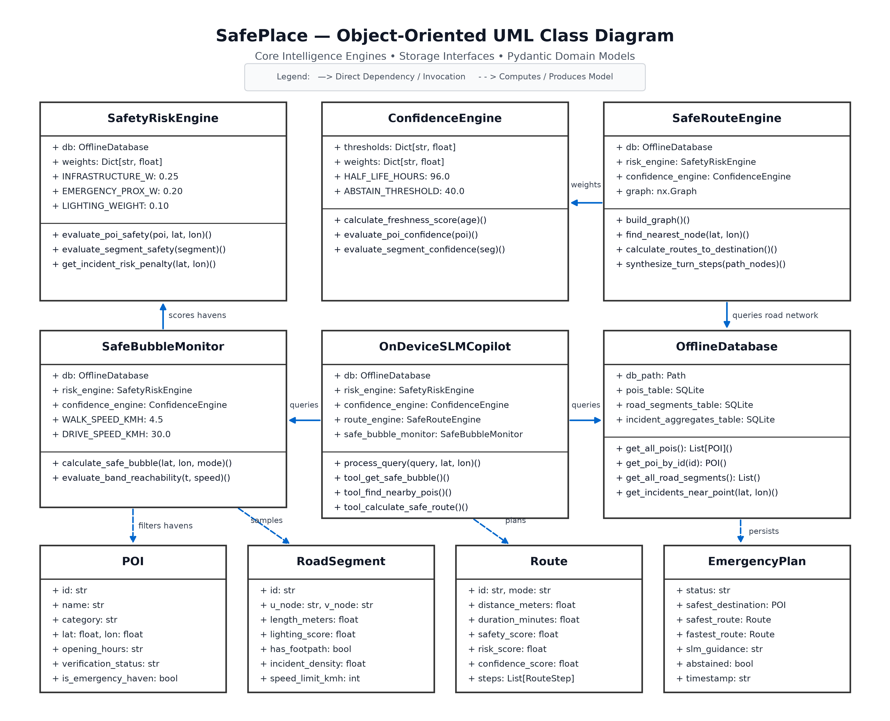
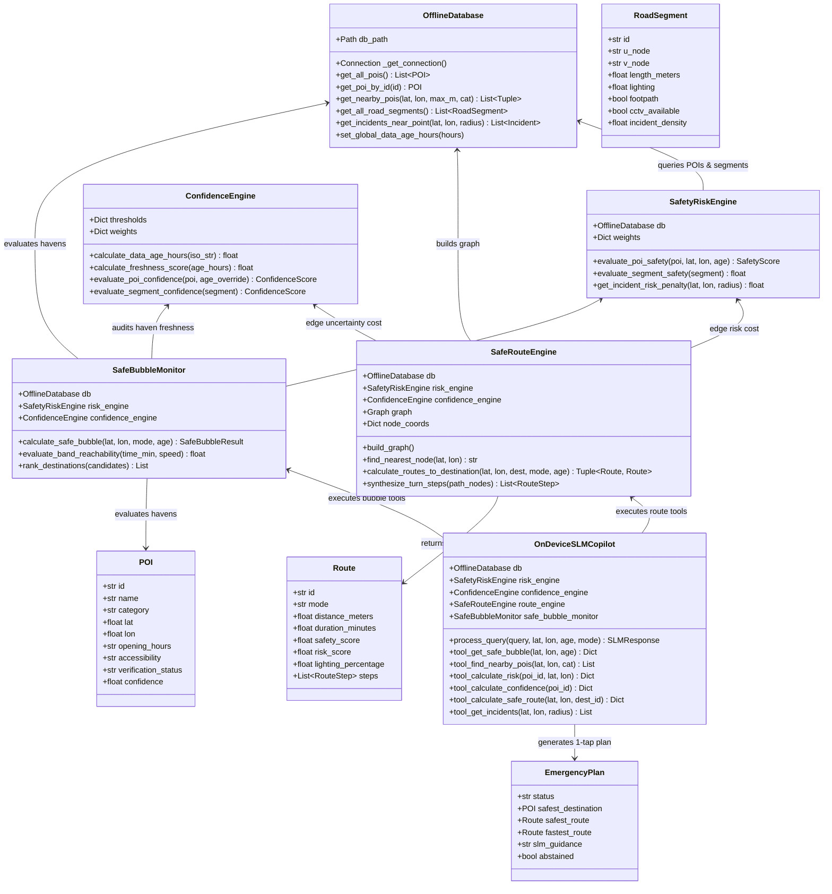
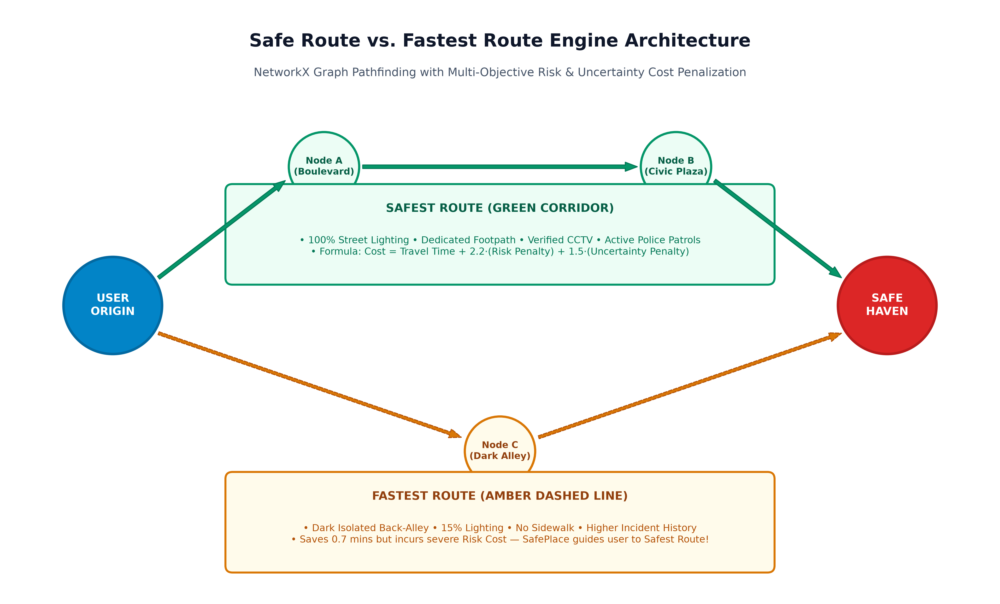
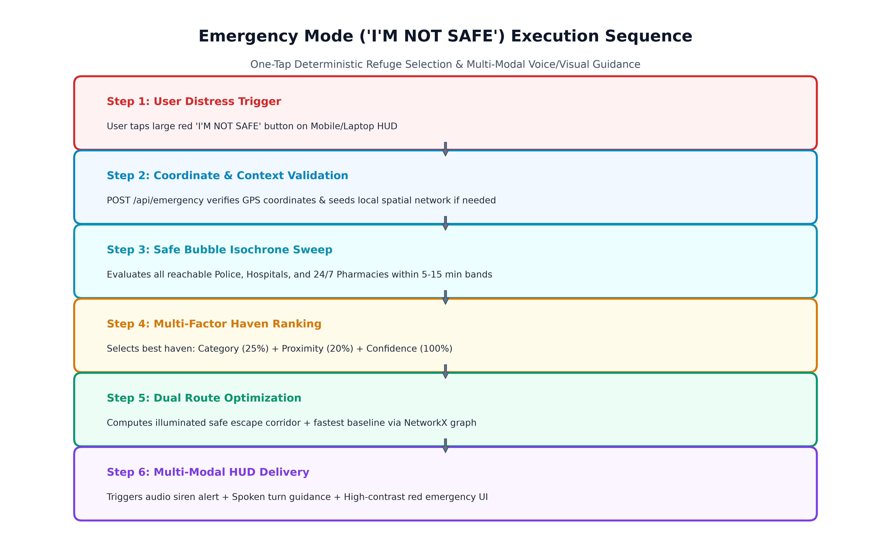
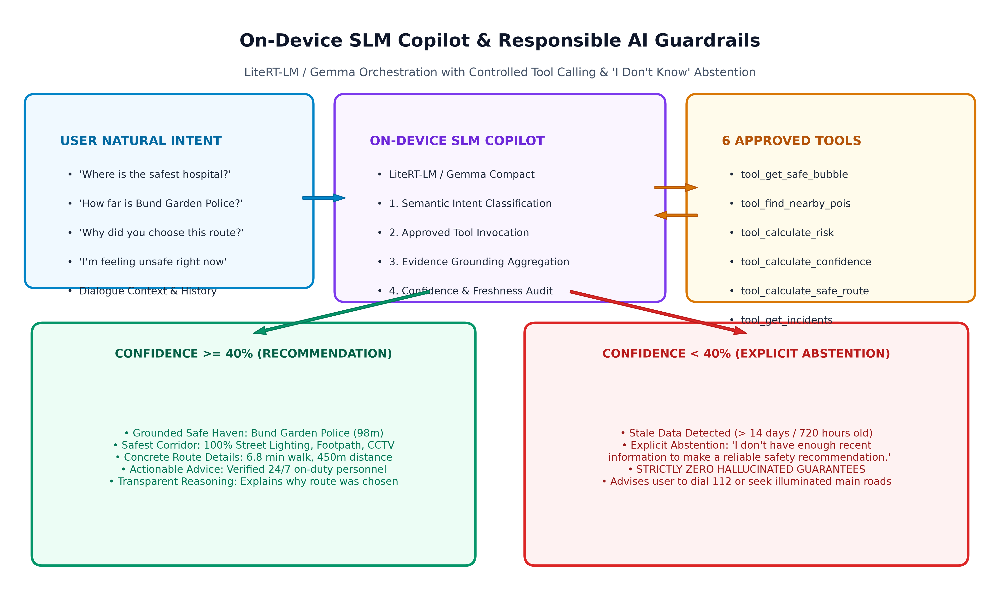

# SafePlace — Technical Architecture & Class Specifications

> **Offline-First AI Safety Copilot**  
> Complete Architectural Reference, Object-Oriented Class Models, Execution Flows, and Responsible AI Guardrails

---

## 1. Object-Oriented UML Class Diagram

SafePlace is engineered using a decoupled, modular object-oriented architecture. Core analytical engines operate independently of the transport layer, utilizing deterministic algorithms and local SQLite spatial indexing.





---

## 2. Complete Architectural Flows Used

SafePlace coordinates several deterministic pipelines depending on user intent and contextual state:

### Flow 1: User Geolocation & Dynamic Spatial Anchoring Flow
```
[User GPS / Preset Selector] 
       │
       ▼
[GET /api/pois or POST /api/set-location]
       │
       ▼
[ensure_location_context(lat, lon)]
       ├─► Nearest POI <= 5000m? ──► Use Existing Local Spatial Network
       │
       └─► Nearest POI > 5000m? ──► [seed_database_with_coords()]
                                           │
                                           ├─► Synthesizes verified local havens (Police, Hospital, 24/7 Pharmacy)
                                           ├─► Generates illuminated road grid & alleyways
                                           └─► [route_engine.build_graph()] (Rebuilds NetworkX routing graph)
```

---

### Flow 2: Dynamic Safe Bubble & Isochrone Reachability Flow
Calculates reachable safe havens across **5-minute, 10-minute, and 15-minute** time windows based on user travel mode:

```
[Safe Bubble Request (lat, lon, mode)]
       │
       ├─► Mode: Walking  ──► Speed = 4.5 km/h  ──► 5m: 375m  | 10m: 750m  | 15m: 1125m
       └─► Mode: Driving  ──► Speed = 30.0 km/h ──► 5m: 2500m | 10m: 5000m | 15m: 7500m
       │
       ▼
[Haversine Geospatial Sweep across all local POIs]
       │
       ▼
[For each candidate POI within 15-min isochrone]:
       ├─► SafetyRiskEngine: Computes Multi-Factor Haven Safety Score (0-100)
       ├─► ConfidenceEngine: Evaluates Freshness Decay & Source Trust
       └─► Classifies into 5m, 10m, or 15m Band
       │
       ▼
[Sort & Select Recommended Haven] ──► Output SafeBubbleResult (Bands, Zone Confidence)
```

---

### Flow 3: Dual Route Pathfinding Flow (Safest vs. Fastest)
SafePlace computes two distinct paths through the local NetworkX graph to highlight the trade-off between well-lit corridors and dark shortcuts:



```
[Start Node (User Origin)] ───────────────► [Target Node (Safe Haven)]
           │                                          │
           ├─► FASTEST ROUTE OBJECTIVE:               │
           │   Edge Weight = Travel Time (s)          │
           │   Algorithm: Dijkstra Shortest Path      │
           │   Result: Minimizes pure duration        │
           │   (Cuts through dark alleyway shortcut)  │
           │                                          │
           └─► SAFEST ROUTE OBJECTIVE:                │
               Edge Weight = Time + Risk + Uncert.    │
               Risk Penalty = (Risk/100) * 2.2 * Time │
               Uncertainty  = (Unc/100)  * 1.5 * Time │
               Algorithm: Weighted A* / Dijkstra      │
               Result: Maximizes illumination (100%), │
               CCTV coverage, and raised footpaths    │
```

---

### Flow 4: Emergency Mode ("I'M NOT SAFE") Flow
1-tap instantaneous distress flow executing with zero external network dependency:



```
[User Taps 'I'M NOT SAFE']
       │
       ▼
[POST /api/emergency (user_lat, user_lon, travel_mode)]
       │
       ├─► 1. Trigger SafeBubble: Finds all havens within 15-min reachability
       ├─► 2. Rank Havens: Selects highest-safety 24/7 haven (Police / Trauma Hospital)
       ├─► 3. Route Engine: Generates illuminated escape corridor + baseline fastest route
       ├─► 4. Confidence Check: Verifies data freshness (warns if stale)
       └─► 5. Synthesizes Emergency Guidance Action Plan
       │
       ▼
[Client HUD Response]:
       ├─► Flashes high-visibility Red Emergency Banner
       ├─► Triggers oscillating Emergency Audio Siren
       ├─► Draws bold Green Escape Corridor on Map
       └─► Native SpeechSynthesis reads aloud turn-by-turn spoken guidance
```

---

### Flow 5: On-Device SLM Tool Calling & "I Don't Know" Abstention Guardrail
The on-device SLM Copilot (LiteRT-LM / Gemma compact) utilizes a strictly controlled tool-use pipeline to prevent hallucination:



```
[User Natural Query: "Is this route safe?"]
       │
       ▼
[Semantic Intent Router]
       │
       ├─► Invokes: tool_calculate_risk(poi_id)
       ├─► Invokes: tool_calculate_confidence(poi_id)
       └─► Invokes: tool_calculate_safe_route(lat, lon, dest_id)
       │
       ▼
[Data Trust & Confidence Audit]:
       │
       ├─► Confidence >= 40.0%?
       │   └──► GROUNDED RECOMMENDATION:
       │        • Recommends verified haven with 24/7 status
       │        • Explains route evidence: 100% lighting, CCTV, footpaths
       │        • Provides concrete walk time and distance
       │
       └─► Confidence < 40.0%? (Stale data > 14 days / 720h)
           └──► EXPLICIT ABSTENTION ("I Don't Know" Guardrail):
                • Refuses to guess or provide false safety guarantees
                • "I don't have enough recent information to make a recommendation."
                • Advises dialing 112 or proceeding cautiously along major illuminated roads.
```

---

## 3. Mathematical Scoring Formulations

### 3.1 Multi-Factor Safety Risk Model (0–100)
$$\text{Safety Score} = 0.25 \cdot I + 0.20 \cdot E + 0.15 \cdot A + 0.15 \cdot (100 - P) + 0.10 \cdot L + 0.10 \cdot F + 0.05 \cdot D$$

* $I$ (**Infrastructure**, 25%): Primary thoroughfare (100) vs. secondary road (75) vs. narrow alleyway (30).
* $E$ (**Emergency Proximity**, 20%): Direct emergency facility presence (100) or decaying with distance: $\max(20, 100 - d/20)$.
* $A$ (**Activity Proxy**, 15%): 24/7 verified commercial hubs, transit terminals, high foot traffic (95) vs. isolated (75).
* $P$ (**Incident Pattern**, 15%): Density penalty calculated from aggregated safety reports within 400m radius.
* $L$ (**Street Lighting**, 10%): Illumination factor ($0.0 - 1.0 \times 100$).
* $F$ (**Pedestrian Footpath**, 10%): Dedicated separated pedestrian walkway present ($100$ if true, $0$ if false).
* $D$ (**Data Freshness**, 5%): Freshness decay score ($0 - 100$).

### 3.2 Exponential Freshness Half-Life Decay
$$\text{Freshness}(t) = 100 \times \exp\left(-0.693 \times \frac{t - 6.0}{96.0}\right) \quad (\text{for } t > 6\text{ hours})$$

* Data under 6 hours old maintains **100% freshness**.
* Half-life $t_{1/2} = 96\text{ hours}$ (4 days).
* After 336 hours (14 days), freshness drops below 10%, lowering composite confidence below $40\%$ and triggering the **"I Don't Know" abstention mechanism**.
