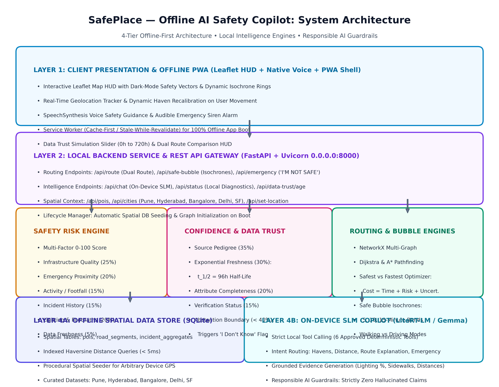
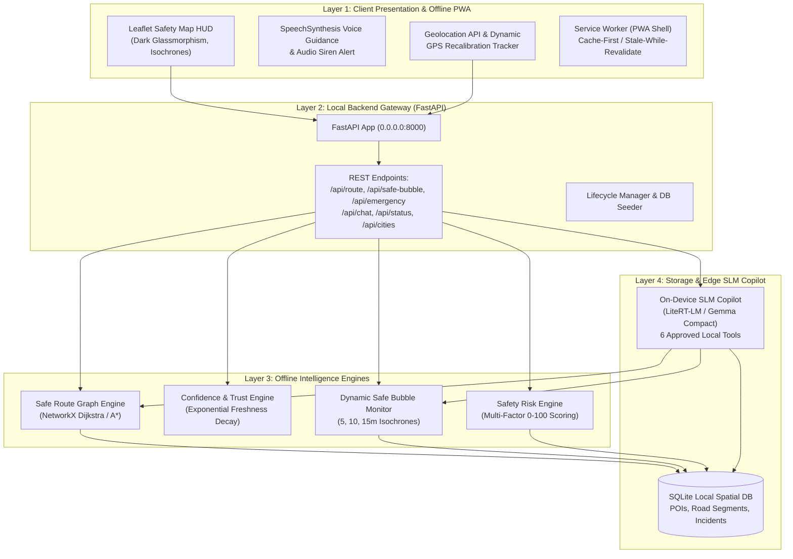

# SafePlace — Offline AI Safety Copilot

> **Concept**: An offline-first AI safety copilot that helps a person find the safest reachable place and route, explains why it made the recommendation, continuously monitors a dynamic safety bubble, and explicitly knows when available evidence is insufficient.

---

## 🌟 Key Innovations

1. **Offline-First AI Architecture**: Runs completely on-device without internet or cellular connectivity using local SQLite spatial indexing, NetworkX graph routing, and an on-device SLM Copilot (LiteRT-LM / Gemma).
2. **Safe Route vs. Fastest Route**: Rather than optimizing only for distance or travel time, SafePlace computes risk penalties based on street lighting, dedicated footpaths, CCTV coverage, and emergency service proximity.
3. **Uncertainty-Aware AI ("I Don't Know" Mechanism)**: When local safety evidence becomes stale (>14 days old, half-life $t_{1/2} = 96\text{h}$) or incomplete, confidence drops below 40% and the AI explicitly abstains rather than hallucinating an ungrounded safety guarantee.
4. **Dynamic Safe Bubble**: Continuously calculates trusted havens (Police, Hospitals, 24/7 Pharmacies, Shelters) reachable within 5, 10, and 15-minute isochrones for walking (4.5 km/h) or driving (30 km/h).
5. **Emergency Mode ("I'M NOT SAFE")**: One-tap trigger that instantly identifies the highest-confidence safety haven, highlights the illuminated safe corridor, triggers an audible siren alert, and provides spoken voice navigation.
6. **Data Trust Layer**: Evaluates source pedigree (35%), freshness half-life decay (30%), attribute completeness (20%), and verification status (15%).
7. **PWA Offline Shell**: Progressive Web App with Cache-First Service Worker, responsive mobile touch layout, and local font/icon assets for 100% offline startup.

---

## 🏗️ System Architecture





> 📄 **Technical Architecture & Class Models**: See [ARCHITECTURE.md](ARCHITECTURE.md) (or [docs/ARCHITECTURE.md](docs/ARCHITECTURE.md)) for the complete UML class diagram, system execution flows, and mathematical models.  
> 📘 **Executive Word Document**: See `SafePlace_Complete_Project_Documentation.docx` (2.8 MB) with embedded white-background diagrams.

---

## 📂 Project Structure

```
SafePlace
├── run.py                                      # One-click launcher (seeds DB, boots server & opens browser)
├── requirements.txt                            # Python dependencies (FastAPI, NetworkX, Pytest, Pillow, docx, etc.)
├── config.py                                   # System weights, confidence thresholds & travel parameters
├── SafePlace_Complete_Project_Documentation.docx # Complete executive & technical specification in Word format
│
├── core/                                       # Offline Intelligence Engines
│   ├── models.py                               # Pydantic data schemas (POI, RoadSegment, Route, SafeBubble)
│   ├── database.py                             # SQLite Spatial & Offline Data Store with Haversine distance
│   ├── risk_engine.py                          # Multi-Factor Safety Risk Scoring Model (0-100 score)
│   ├── confidence_engine.py                    # Data Trust & "I Don't Know" Abstention Engine (t_1/2 = 96h)
│   ├── route_engine.py                         # Safe vs. Fast Pathfinding (NetworkX A*/Dijkstra)
│   ├── safe_bubble.py                          # Dynamic Safe Bubble Isochrone Monitor (5, 10, 15 min)
│   └── slm_engine.py                           # On-device SLM Copilot with Controlled Tools & Guardrails
│
├── data/                                       # Data Foundry & Pre-packaged GIS Data
│   ├── dataset_builder.py                      # Multi-region GIS builder, city presets & dynamic coordinate seeder
│   ├── sample_city_data.json                   # Structured benchmark dataset
│   └── safeplace_offline.db                    # Built local SQLite database
│
├── api/                                        # Backend REST API
│   ├── server.py                               # FastAPI application & static PWA mounting
│   └── routes.py                               # 11 REST endpoints (/api/pois, /api/safe-bubble, /api/route, etc.)
│
├── ui/                                         # Progressive Web App HUD & Map Dashboard
│   ├── index.html                              # Leaflet map interface, Emergency HUD, AI Chat, Layout Detector
│   ├── manifest.json                           # PWA Web App Manifest
│   ├── service-worker.js                       # Offline caching service worker (Cache-First strategy)
│   ├── css/style.css                           # Dark glassmorphism safety theme & mobile responsive rules
│   ├── js/app.js                               # Interactive controller, GPS tracker, Voice UI & sirens
│   └── vendor/                                 # 100% offline bundles (Leaflet 1.9, FontAwesome 6)
│
├── docs/                                       # Documentation & Architecture Diagrams
│   ├── ARCHITECTURE.md                         # Detailed technical architecture document
│   └── diagrams/                               # High-resolution PNG architecture diagrams
│
└── tests/                                      # Automated Pytest Suite (46 test cases across 10 suites)
    ├── test_database.py                        # SQLite spatial queries & distance checks (4 tests)
    ├── test_risk_engine.py                     # Multi-factor risk calculation tests (2 tests)
    ├── test_confidence_engine.py               # Freshness decay & abstention tests (2 tests)
    ├── test_route_engine.py                    # Fastest vs. Safest route comparison tests (1 test)
    ├── test_safe_bubble.py                     # Dynamic isochrone reachability tests (1 test)
    ├── test_slm_copilot.py                     # SLM tool execution & grounded reasoning tests (8 tests)
    ├── test_api.py                             # FastAPI REST endpoint integration tests (8 tests)
    ├── test_dynamic_location.py                # Dynamic coordinate seeding & Pune preset (5 tests)
    ├── test_calibration_and_chat.py            # Movement haven calibration & dialogue flows (3 tests)
    └── test_mobile_and_offline_edge_cases.py   # Mobile viewport, speeds, offline caching (12 tests)
```

---

## 🚀 Quick Start

### 1. Install Dependencies
```bash
python -m pip install -r requirements.txt
```

### 2. Launch SafePlace
```bash
python run.py
```
This automatically seeds the offline database, boots the FastAPI server at `http://127.0.0.1:8000`, and opens the interactive dashboard in your web browser.

---

## 🧪 Running Automated Tests

Run the complete test suite with verbose output:
```bash
python -m pytest tests/ -v
```
All **46 automated test cases** validate spatial indexing, risk scoring, confidence decay, safe vs. fast routing, dynamic safe bubble, SLM tool orchestration, dialogue transitions, dynamic GPS generation, and mobile/PWA offline invariants.

---

## 🎬 Demo Walkthrough

1. **Explore City Presets**: Select from the top bar dropdown:
   - 🇮🇳 **Pune (Camp / Shivajinagar)**: Bund Garden Police, Sassoon General Hospital, Apollo 24/7.
   - 🇮🇳 **Hyderabad (HITEC City / Madhapur)**: Cyberabad Police Station, Medicover Hospital, Apollo 24/7.
   - 🇮🇳 **Bangalore (MG Road / Indiranagar)**: Cubbon Park Police Station, Manipal Hospital, MedPlus 24/7.
   - 🇮🇳 **Delhi (Connaught Place)**: Parliament Street Police, RML Hospital, 24/7 Chemist.
   - 🇮🇳 **Mumbai (Bandra / BKC)**: Bandra Police Station, Lilavati Hospital, Noble Chemist.
   - 🇺🇸 **San Francisco (Downtown)**: SFPD Tenderloin Station, St. Francis Memorial Hospital.
2. **Use Real Device GPS**: Click the **"📍 Locate Me"** button in the header bar. SafePlace reads your device GPS and dynamically generates an illuminated local safety corridor and verified havens around your position!
3. **Move GPS Position**: Drag the blue user marker on the map to see the **Safe Bubble** concentric rings (5m, 10m, 15m) dynamically recalculate.
4. **Compare Safe vs. Fast Routes**: Click on any safe haven and toggle between:
   - **Safest Route** (Green line): Follows illuminated main boulevards (100% lighting, CCTV, dedicated sidewalks).
   - **Fastest Route** (Amber dashed line): Cuts through dark back-alleys (saves 0.7 min, but drops lighting to 15% with higher hazard risk).
5. **Trigger Emergency Mode**: Click the large red **"I'M NOT SAFE"** button for instant emergency routing, audio siren alert, and spoken turn-by-turn guidance.
6. **Demonstrate Uncertainty & "I Don't Know" Abstention**:
   - Drag the **Data Age slider** in the top bar from `0h` to `720h` (1 month old).
   - Ask the AI Copilot: *"Where is the safest place I can go right now?"*
   - Watch the AI dynamically detect stale data, decrease confidence, and explicitly **abstain** (*"I don't have enough recent information to make a reliable safety recommendation..."*) rather than guessing!
7. **Re-sync Data**: Click **"Sync Data"** to refresh verified municipal packages back to 100% confidence.

---

## 📡 REST API Reference

| Method | Endpoint | Parameters / Body | Description |
| :--- | :--- | :--- | :--- |
| `GET` | `/api/status` | None | Offline system health, model versions, and spatial record statistics |
| `GET` | `/api/pois` | `category`, `lat`, `lon` | Retrieves verified safe POIs with optional proximity filtering |
| `GET` | `/api/safe-bubble` | `lat`, `lon`, `travel_mode`, `data_age_hours` | Computes dynamic 5, 10, and 15-minute reachable haven isochrones |
| `GET` | `/api/route` | `lat`, `lon`, `destination_id`, `travel_mode` | Computes dual routes (Safest vs Fastest) with safety gain comparison |
| `POST` | `/api/emergency` | `{ user_lat, user_lon, travel_mode }` | 1-tap emergency refuge trigger with dual corridors and voice plan |
| `POST` | `/api/chat` | `{ query, user_lat, user_lon, travel_mode }` | On-device SLM Copilot with controlled local tools and grounding |
| `GET` | `/api/cities` | None | Lists available pre-packaged city presets |
| `POST` | `/api/switch-city` | `{ city_key }` | Switches active municipal dataset and rebuilds routing graph |
| `POST` | `/api/set-location` | `{ lat, lon, name }` | Procedurally generates safety network around arbitrary GPS fix |
| `POST` | `/api/data-trust/age`| `{ hours }` | Dynamically shifts data staleness to test confidence decay |
| `POST` | `/api/sync` | `city_key` | Simulates municipal cloud sync restoring freshness to 100% |

---

## 📜 Responsible AI Guardrails

- **No False Guarantees**: Uses "estimated risk" and "confidence", never claims absolute safety.
- **Uncertainty Awareness**: Explicitly abstains when data is stale, missing, or contradictory ($<40\%$ threshold).
- **Transparent Evidence**: Every recommendation provides grounded evidence (lighting %, infrastructure quality, distance, data age).
- **Privacy First**: All core processing is on-device with zero location telemetry transmission.
