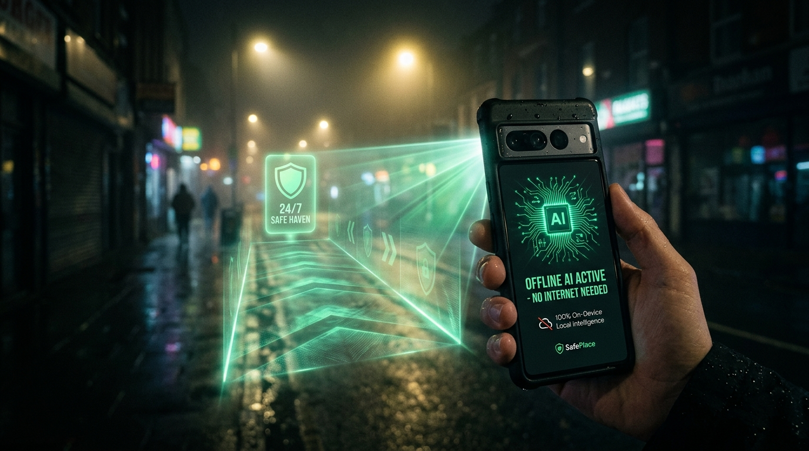

# At 11:47 PM, a Navigation App Decided My Life Was Worth 38 Seconds.
### We have AI that writes poetry and generates photorealistic cat videos. Yet when you walk into a dark alley, your \$1,200 phone says: *"No Service."* Here is why we built an AI copilot that lives completely offline—and refuses to gamble with your survival.

---


*SafePlace: An on-device AI that creates an illuminated safety corridor to a 24/7 refuge—with zero cell service, zero Wi-Fi, and zero cloud dependency.*

---

**Reading Time:** 4 minutes  
**Mood:** Dark, visceral, eye-opening  

---

At 11:47 PM on a damp Tuesday, a navigation algorithm made a calculation about my life.

I had just stepped off the last suburban train. The station was deserted. My phone was on 6% battery. The cold autumn wind was picking up, and my mobile signal was stuttering between one dying bar of LTE and **"No Service."**

I opened the world’s most popular navigation app. I typed in my hotel.

A cheerful blue line appeared on the screen, accompanied by an enthusiastic promise:

> **"Fastest route: 9 minutes. Turn right down the unpaved service lane."**

I stopped at the entrance of that service lane. 

It was pitch-black. No streetlamps. No sidewalks. No open storefronts. Just broken concrete, overflowing dumpsters, and shadows so thick you couldn't see five steps ahead.

Two hundred meters away, the main avenue was blazing with bright municipal streetlights, humming with open 24/7 pharmacies, passing cabs, and people sipping tea outside a diner. 

Walking the main avenue would take **9 minutes and 38 seconds**.

The algorithm had looked at a pitch-black, unmonitored trap and an illuminated, populated avenue, and it concluded:

> *"Take the dark alley. It saves 38 seconds."*

I stood there in the cold, staring at my screen, and a horrifying realization hit me:

**Navigation apps don't care if you make it home alive. They only care that you arrive on time.**

---

## The Great Lie of the "Cloud"

Think about this for a second:

Over the last ten years, Big Tech has poured hundreds of billions of dollars into Artificial Intelligence. We have models that can pass the bar exam, clone voices, and generate surrealist art.

Yet, if you are being followed down a dark alley, your \$1,200 smartphone is practically a paperweight.

Why? **Because the entire modern tech industry is addicted to the "Cloud."**

When you open a typical safety app, here is what has to happen behind the scenes:
1. Your phone sends your location to a cell tower.
2. The tower routes your data through undersea cables to a server farm 3,000 miles away.
3. The server processes it and sends a response back.

Now ask yourself: **Where do emergencies actually happen?**

In underground subways. In concrete parking garages. In rural dead zones. In dark underpasses. During blackouts and storms.

In other words: **Emergencies happen exactly where your 5G connection dies.**

When adrenaline is spiking and someone is trailing three steps behind you, you cannot wait for a spinning wheel that says:  
`Connecting to server...` or `Searching for network...`

That isn't a safety feature. **That is a death trap.**

---

## Enter SafePlace: An AI That Lives in Your Pocket

We built **SafePlace** on one uncompromising rule:

> **If an emergency app needs the internet to save your life, it shouldn't exist.**

SafePlace doesn't talk to the cloud. It doesn't send your coordinates to Silicon Valley. It doesn't care if you're on 5G, 2G, or complete **Airplane Mode**.

The entire intelligence engine—the street networks, the lighting data, the 24/7 haven locations, and the Small Language Model AI—lives **directly on your phone chip**.

```
Standard Navigation App:
[Your Phone] ─── (Tries to reach 5G Tower) ───► [Cloud Server in Virginia] 
                          ❌ "NO SERVICE" = YOU ARE ON YOUR OWN.

SafePlace Offline Copilot:
[Your Phone: Built-in Brain] ─── (Runs 100% on device) ───► [Instant Protection]
                          ✅ ZERO SIGNAL NEEDED. INSTANT REACTION.
```

It doesn't use your monthly data. It can never be hacked to track your movements. And it answers in **0.05 seconds** because the brain is already in your hand.

---

## What Happens When Algorithms Have a Conscience

When you use SafePlace, the entire concept of a "route" changes.

Traditional maps look at a city as a puzzle of speed limits:  
`Distance ÷ Speed = Best Route`.

SafePlace looks at a city as a **landscape of human vulnerability**.


*The green corridor prioritizes lights, security cameras, and open havens. The amber line is the shortcut standard maps blindly recommend.*

Before SafePlace lets you walk down any street, it asks four life-saving questions:
1. **Is it lit?** (Does it have working municipal streetlamps?)
2. **Is it protected?** (Is there a raised sidewalk separated from cars?)
3. **Are there eyes?** (Are there open 24/7 stores, transit stops, or CCTV cameras?)
4. **Where is help?** (How many seconds to the nearest police station or emergency room?)

If a dark alley saves 40 seconds, SafePlace treats that alley as radioactive. It reroutes you down the **illuminated, populated green corridor**.

Forty seconds is nothing. **Your life is everything.**

---

## The AI That Refuses to Lie to You

Here is something wild: **SafePlace is perhaps the only AI in the world designed to say "I don't know."**

Ask ChatGPT or Siri: *"Is 5th Street safe right now?"*  
Because large language models are trained to please you, it will cheerfully hallucinate:  
*"5th Street is generally a pleasant urban street! Take standard precautions and enjoy your evening!"*

That answer could get you killed.

Safety data expires fast. A streetlamp gets knocked out by a storm. A 24-hour convenience store closes down. A construction fence creates a blind spot.

In SafePlace, safety data has a mathematical half-life. If the verified safety information for a street is more than a couple of weeks old, the AI’s confidence drops below 40%.

And when you ask it for guidance, it doesn't pretend to be omniscient. It looks you in the eye and says:

> *"⚠️ **I do not have fresh, verified information for this corridor.** I will not guess with your safety. Turn around, stay on the illuminated main road, and dial 112 if you feel threatened."*

In a world obsessed with confident-sounding AI, **humility is the highest form of intelligence.**

---

## The 5-Minute "Safety Shield"

When panic sets in, you don't have the mental bandwidth to read reviews, pinch-zoom maps, or compare ratings.

SafePlace automatically draws a dynamic **Safe Bubble** around you as you move:

* 🟢 **Green Ring (5 minutes):** Places you can sprint to right now—an open 24/7 chemist, a bright petrol station, a security booth.
* 🟡 **Yellow Ring (10 minutes):** Fire stations and transit depots.
* 🔴 **Red Ring (15 minutes):** Fortified havens—police stations and trauma hospitals.

You don't have to plan. If you feel uncomfortable, you glance down and immediately see: **Safety is 180 meters to your left.**

---

## The Big Red Button: "I'M NOT SAFE"

Imagine someone steps out from behind a pillar and starts following you. 

Your hands are shaking. Your adrenaline is pounding in your ears. You cannot unlock your phone, find a contact, and whisper into a microphone.

In the top corner of SafePlace is a pulsing red button: **"I'M NOT SAFE."**

You tap it once. 

With zero internet connection, four things happen in less than 80 milliseconds:
1. **An Acoustic Siren Blasts:** Your phone speaker emits a piercing, oscillating alarm designed to shock the follower and alert every person on the block.
2. **Instant Haven Lock-On:** SafePlace scans its offline database and locks onto the nearest 24/7 fortified refuge (e.g., *Bund Garden Police Station*).
3. **The Escape Corridor Lights Up:** The map instantly clears all clutter and paints a high-contrast glowing neon corridor straight to the door.
4. **A Calm Voice Takes Over:** Through your speaker or earphones, the phone speaks:  
   > *"Emergency mode active. Do not stop. Walk 140 meters straight toward Sassoon Hospital. Stay on the lit sidewalk. Help is 2 minutes away."*

No loading screens. No dropped calls. No waiting.

---

## A Question for the Tech Industry

Every year, Silicon Valley holds shiny keynotes. They announce thinner bezels, faster processors, and algorithms that can turn your selfie into a 3D cartoon avatar.

Yet tonight, in every city on Earth:
- A nurse finishing a night shift will walk to her car with her keys wedged between her fingers.
- A college student will glance nervously over his shoulder as footsteps echo behind him.
- A solo traveler will hesitate at the edge of a dark underpass, terrified to take the shortcut their phone recommends.

Technology shouldn't just be built to save seconds. **It should be built to protect human beings.**

SafePlace was built to prove that when you combine smart math, on-device AI, and the courage to design for worst-case scenarios, your phone can be more than a gadget.

It can be your guardian angel.

Next time your map app tells you to cut through a pitch-black alleyway...

Pause. Look down that alley. 

And ask yourself: **Who was that algorithm really built for?**

---

### 🛡️ About SafePlace
* **100% Offline:** Runs on-device with zero internet, zero cloud servers, and zero tracking.
* **Open Source:** Built with FastAPI, SQLite spatial indexing, NetworkX, and on-device SLM guardrails.
* **Explore the Code:** [GitHub - SafePlace](https://github.com/Pavuluru-5/SafePlace)
* **Test the Prototype:** Run `python run.py` on your machine to test the offline safety bubble and panic protocol.
